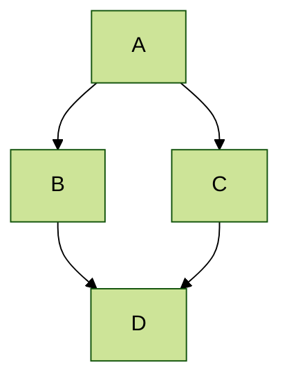



## Locations of key files/directories

* Opções básicas de configuração: _config.yml  
* Configuração da barra de navegação superior: _data/navigation.yml  
* Páginas individuais: _pages/  
* Coleções de páginas são arquivos .md ou .html em:
  * _publications/  
  * _portfolio/  
  * _posts/  
  * _teaching/  
  * _talks/  
* Rodapé: _includes/footer.html  
* Arquivos estáticos (como PDFs): /files/  
* Imagem de perfil (pode ser definida em _config.yml): images/profile.png  

## Tips and hints

* Nomeie um arquivo como ".md" para que ele seja renderizado em Markdown, ou como ".html" para que seja renderizado em HTML.  
* Vá até a [commit list](https://github.com/academicpages/academicpages.github.io/commits/master) (no seu repositório) para encontrar a última versão que o GitHub compilou com Jekyll.  
  * Marca de verificação verde: compilação bem-sucedida  
  * Círculo laranja: em processo de compilação  
  * X vermelho: erro  
  * Sem ícone: não foi compilado  

* O Academic Pages utiliza [Jekyll Kramdown](https://jekyllrb.com/docs/configuration/markdown/), um parser de GitHub Flavored Markdown (GFM), que é semelhante à versão de Markdown usada no GitHub, mas pode ter algumas pequenas diferenças.  
  * Alguns emojis suportados no GitHub também são suportados por meio do plugin [Jemoji](https://github.com/jekyll/jemoji) :computer:.  
  * A melhor lista de emojis suportados pode ser encontrada no post [Emojis for Jekyll via Jemoji](https://www.fabriziomusacchio.com/blog/2021-08-16-emojis_for_Jekyll/#computer).

* Embora o GitHub Pages impeça a execução de código no lado do servidor, scripts do lado do cliente são suportados.  
  * Isso significa que o Google Analytics é compatível, e [the wiki](https://github.com/academicpages/academicpages.github.io/wiki/Adding-Google-Analytics) deve conter as informações mais atualizadas sobre como configurá-lo.
    
* Seu CV pode ser escrito usando Markdown ([preview](https://academicpages.github.io/cv/)) ou gerado via JSON ([preview](https://academicpages.github.io/cv-json/)), e os layouts são ligeiramente diferentes. Você pode atualizar o caminho para o que estiver sendo usado em `_data/navigation.yml`, sendo que o CV formatado em JSON fica oculto por padrão.

* O [Liquid syntax guide](https://shopify.github.io/liquid/tags/control-flow/) é um guia útil para quem deseja adicionar funcionalidades ao modelo ou se tornar um colaborador do [template on GitHub](https://github.com/academicpages/academicpages.github.io).
  
## MathJax 

O suporte ao MathJax (versão 3.* via [jsDelivr](https://www.jsdelivr.com/), [documentation](https://docs.mathjax.org/en/latest/)) está incluído no modelo:

$$
\displaylines{
\nabla \cdot E= \frac{\rho}{\epsilon_0} \\\
\nabla \cdot B=0 \\\
\nabla \times E= -\partial_tB \\\
\nabla \times B  = \mu_0 \left(J + \varepsilon_0 \partial_t E \right)
}
$$

Os delimitadores padrão `$$...$$` e `\\[...\\]` são suportados para matemática em bloco, enquanto `\\(...\\)` deve ser usado para matemática em linha (por exemplo, \\(a^2 + b^2 = c^2\\)).

**Nota**: como o Academic Pages utiliza Markdown, isso pode causar alguma interferência com o MathJax e o LaTeX no que diz respeito a caracteres de escape e quebras de linha, embora [algumas soluções alternativas existam](https://math.codidact.com/posts/278763/278772#answer-278772). Em alguns casos, como ao incluir MathJax em um campo `citation` para publicações, pode ser necessário usar `\(...\)` para delimitação inline.

## Mermaid diagrams

O Academic Pages inclui suporte para [Mermaid diagrams](https://mermaid.js.org/) (versão 11.* via [jsDelivr](https://www.jsdelivr.com/)) e, além dos [tutorials](https://mermaid.js.org/ecosystem/tutorials.html) e da [GitHub documentation](https://github.com/mermaid-js/mermaid), a sintaxe básica é a seguinte:

```markdown
    ```mermaid
    graph LR
    A-->B
    ```
```

O que produz o seguinte gráfico com o [default theme](https://mermaid.js.org/config/theming.html) aplicado:


Já um gráfico mais avançado com o tema `forest` aplicado se parece com o seguinte:


## Plotly

O Academic Pages inclui suporte para gráficos do Plotly por meio de um hook nos elementos de código Markdown, embora aqueles que tenham familiaridade com HTML e JavaScript também possam acessá-lo [via those routes](https://plotly.com/javascript/getting-started/). O Plotly é incluído via um [package](https://www.npmjs.com/package/plotly.js?activeTab=readme) do npm e é distribuído como parte do JavaScript minimizado que faz parte do modelo.

Para renderizar um gráfico do Plotly via Markdown, os dados do gráfico precisam ser adicionados da seguinte forma:

```markdown
    ```plotly
    {
      "data": [
        {
          "x": [1, 2, 3, 4],
          "y": [10, 15, 13, 17],
          "type": "scatter"
        },
        {
          "x": [1, 2, 3, 4],
          "y": [16, 5, 11, 9],
          "type": "scatter"
        }
      ]
    }
    ```
```

**Importante!** Como os dados são interpretados como JSON, *todas* as chaves precisam estar entre aspas para que o gráfico seja renderizado corretamente. O uso de uma ferramenta como [JSONLint](https://jsonlint.com/) para verificar a sintaxe é altamente recomendado.
{: .notice}

O que produz o seguinte:
```plotly
{
  "data": [
    {
      "x": [1, 2, 3, 4],
      "y": [10, 15, 13, 17],
      "type": "scatter"
    },
    {
      "x": [1, 2, 3, 4],
      "y": [16, 5, 11, 9],
      "type": "scatter"
    }
  ]
}
```

Essencialmente, o que acontece é que os [Plotly attributes](https://plotly.com/javascript/reference/index/) são extraídos do bloco de código como dados em JSON, interpretados e enviados ao Plotly juntamente com um tema que corresponde ao tema atual do site (ou seja, um tema claro ou escuro). Isso permite que todos os gráficos que podem ser descritos pelo atributo `data` sejam renderizados, com algumas limitações relacionadas ao tema do gráfico.

```plotly
{
  "data": [
    {
      "x": [1, 2, 3, 4, 5],
      "y": [1, 6, 3, 6, 1],
      "mode": "markers",
      "type": "scatter",
      "name": "Team A",
      "text": ["A-1", "A-2", "A-3", "A-4", "A-5"],
      "marker": { "size": 12 }
    },
    {
      "x": [1.5, 2.5, 3.5, 4.5, 5.5],
      "y": [4, 1, 7, 1, 4],
      "mode": "markers",
      "type": "scatter",
      "name": "Team B",
      "text": ["B-a", "B-b", "B-c", "B-d", "B-e"],
      "marker": { "size": 12 }
    }    
  ],
  "layout": {
    "xaxis": {
      "range": [ 0.75, 5.25 ]
    },
    "yaxis": {
      "range": [0, 8]
    },
    "title": {"text": "Data Labels Hover"}
  }
}
```

```plotly
{
  "data": [{
      "x": [1, 2, 3],
      "y": [4, 5, 6],
      "type": "scatter"
    },
    {
      "x": [20, 30, 40],
      "y": [50, 60, 70],
      "xaxis": "x2",
      "yaxis": "y2",
      "type": "scatter"
  }],
  "layout": {
    "grid": {
      "rows": 1,
      "columns": 2,
      "pattern": "independent"
    },
    "title": {
      "text": "Simple Subplot"
    }    
  }
}
```

```plotly
{
  "data": [{
		"z": [[10, 10.625, 12.5, 15.625, 20],
          [5.625, 6.25, 8.125, 11.25, 15.625],
          [2.5, 3.125, 5.0, 8.125, 12.5],
          [0.625, 1.25, 3.125, 6.25, 10.625],
          [0, 0.625, 2.5, 5.625, 10]],
		"type": "contour"
	}],
  "layout": {
    "title": {
      "text": "Basic Contour Plot"
    }
  }
}
```

## Markdown guide

O Academic Pages utiliza [kramdown](https://kramdown.gettalong.org/index.html) para renderização de Markdown, que possui algumas diferenças em relação a outras implementações de Markdown, como a do GitHub. Além deste guia, consulte também a [kramdown Syntax page](https://kramdown.gettalong.org/syntax.html) para a documentação completa.  

### Header three

#### Header four

##### Header five

###### Header six

## Blockquotes

Single line blockquote:

> Quotes are cool.

## Tables

### Table 1

| Entry            | Item   |                                                              |
| --------         | ------ | ------------------------------------------------------------ |
| [John Doe](#)    | 2016   | Description of the item in the list                          |
| [Jane Doe](#)    | 2019   | Description of the item in the list                          |
| [Doe Doe](#)     | 2022   | Description of the item in the list                          |

### Table 2

| Header1 | Header2 | Header3 |
|:--------|:-------:|--------:|
| cell1   | cell2   | cell3   |
| cell4   | ce
ll5   | cell6   |
|-----------------------------|
| cell1   | cell2   | cell3   |
| cell4   | cell5   | cell6   |
|=============================|
| Foot1   | Foot2   | Foot3   |

## Definition Lists

Título da lista de definições  
:   Divisão da lista de definições.

Startup  
:   Uma startup é uma empresa ou organização temporária projetada para buscar um modelo de negócio repetível e escalável.

#dowork  
:   Termo criado por Rob Dyrdek e seu guarda-costas Christopher "Big Black" Boykins, "Do Work" funciona como um autoestímulo, motivando você e seus amigos.

Do It Live  
:   Vou deixar o Bill O'Reilly [explicar](https://www.youtube.com/watch?v=O_HyZ5aW76c "We'll Do It Live") este aqui.

## Listas não ordenadas (aninhadas)

  * List item one 
      * List item one 
          * List item one
          * List item two
          * List item three
          * List item four
      * List item two
      * List item three
      * List item four
  * List item two
  * List item three
  * List item four

## Ordered List (Nested)

  1. List item one 
      1. List item one 
          1. List item one
          2. List item two
          3. List item three
          4. List item four
      2. List item two
      3. List item three
      4. List item four
  2. List item two
  3. List item three
  4. List item four

## Buttons

Faça com que qualquer link se destaque mais ao aplicar a classe `.btn`.

## Notices

Avisos básicos ou destaques são suportados usando a seguinte sintaxe:
```markdown
**Watch out!** You can also add notices by appending `{: .notice}` to the line following paragraph.
{: .notice}
```

o que será renderizado como:

**Cuidado!** Você também pode adicionar avisos anexando `{: .notice}` à linha seguinte ao parágrafo.
{: .notice}

### Footnotes

Notas de rodapé podem ser úteis para esclarecer pontos no texto ou citar informações.[^1] O Markdown oferece suporte a notas de rodapé numéricas, bem como texto, desde que os valores sejam únicos.[^note]

```markdown
This is the regular text.[^1] This is more regular text.[^note]

[^1]: This is the footnote itself.
[^note]: This is another footnote.
```

[^1]: Como esta nota de rodapé.  
[^note]: Ao usar texto como marcador de notas de rodapé, não são permitidos espaços no nome.

## HTML Tags

### Address Tag

<address>
  1 Infinite Loop<br /> Cupertino, CA 95014<br /> United States
</address>

### Anchor Tag (aka. Link)

Este é um exemplo de um [link](https://github.com "GitHub").

### Abbreviation Tag

A abreviação CSS significa "Cascading Style Sheets".

*[CSS]: Cascading Style Sheets

### Cite Tag

"Código é poesia." ---<cite>Automattic</cite>

### Code Tag

Você aprenderá mais adiante nestes testes que `word-wrap: break-word;` será seu melhor amigo.

Você também pode escrever blocos maiores de código com destaque de sintaxe suportado para algumas linguagens, como Python:

```python
print('Hello World!')
```

or R:

```R
print("Hello World!", quote = FALSE)
```

### Details Tag (seções recolhíveis)

A tag HTML `<details>` funciona bem com Markdown e permite incluir seções recolhíveis. Veja [W3Schools](https://www.w3schools.com/tags/tag_details.asp) para mais informações sobre como usar a tag.

<details>
  <summary>Recolhido por padrão</summary>
  Esta seção estava recolhida por padrão!
</details>

O código-fonte:

```HTML
<details>
  <summary>Collapsed by default</summary>
  This section was collapsed by default!
</details>
```

Ou você pode deixar uma seção aberta por padrão incluindo o atributo `open` na tag:

<details open>
  <summary>Aberto por padrão</summary>
  Esta seção está aberta por padrão graças ao uso de `open` na tag &lt;details open&gt;!
</details>

### Emphasize Tag

A tag de ênfase deve deixar o texto em _itálico_.

### Insert Tag

Esta tag deve indicar texto <ins>inserido</ins>.

### Keyboard Tag

Esta tag pouco conhecida simula <kbd>texto de teclado</kbd>, que geralmente é estilizado como a tag `<code>`.

### Preformatted Tag

Esta tag estiliza grandes blocos de código.

<pre>
.post-title {
  margin: 0 0 5px;
  font-weight: bold;
  font-size: 38px;
  line-height: 1.2;
  and here's a line of some really, really, really, really long text, just to see how the PRE tag handles it and to find out how it overflows;
}
</pre>

### Quote Tag

<q>Desenvolvedores, desenvolvedores, desenvolvedores&#8230;</q> &#8211;Steve Ballmer

### Strike Tag

Esta tag permite que você <strike>risque o texto</strike>.

### Strong Tag

Esta tag exibe texto em **negrito**.

### Subscript Tag

Aplicando estilo científico com H<sub>2</sub>O, o que deve deixar o "2" em posição inferior.

### Superscript Tag

Continuando com ciência e a equação de Isaac Newton E = MC<sup>2</sup>, o que deve elevar o 2.

### Variable Tag

Isso permite indicar <var>variáveis</var>.

***
**Footnotes**

As notas de rodapé da página serão exibidas após esta linha; retorne à seção <a href="#footnotes">Markdown Footnotes</a>.
